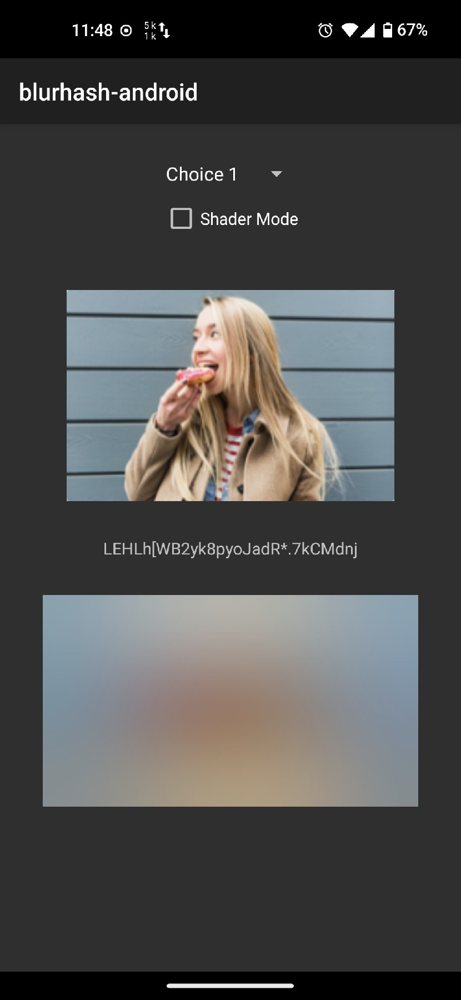
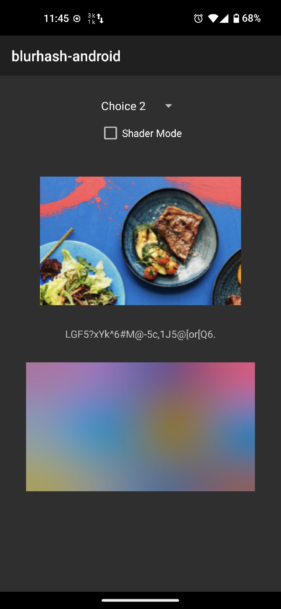
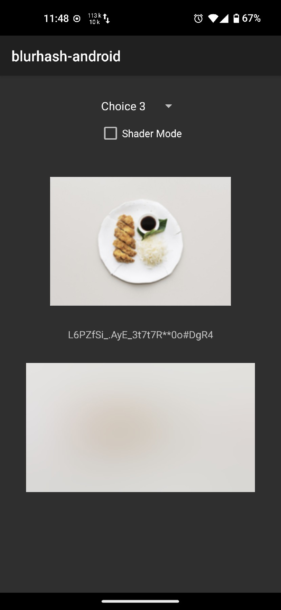
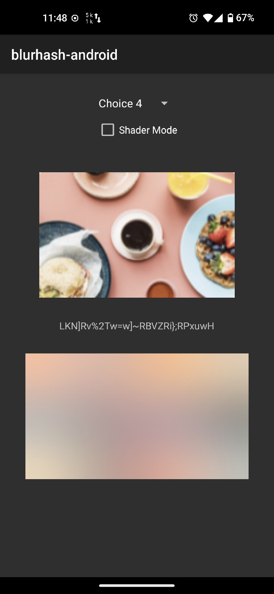

# blurhash-android
BlurHash for Android.

## Capture
| 01                            | 02                            | 03                            | 04                            |
|-------------------------------|-------------------------------|-------------------------------|-------------------------------|
|  |  |  |  |


## How to use
1. Add MavenCenter to your project
    ```
    allprojects {
        repositories {
            mavenCentral()
        }
    }
    ```
   
2. Add dependency
    ```
    implementation "io.github.peerless2012:blurhash:x.x.x"
    ```
   
3. Use `BlurHashDrawable` in your code
    ```
    val drawable = BlurHashDrawable()
    drawable.setBlurHash("LKN]Rv%2Tw=w]~RBVZRi};RPxuwH")
    blurImage.setImageDrawable(drawable)
    ```

## Thanks
* [blurha](https://blurha.sh)
* [shady](https://github.com/drinkthestars/shady)
* [blurhash_shader](https://github.com/xioxin/blurhash_shader)
* [optimization-step-by-step](https://www.romainguy.dev/posts/2024/optimization-step-by-step)